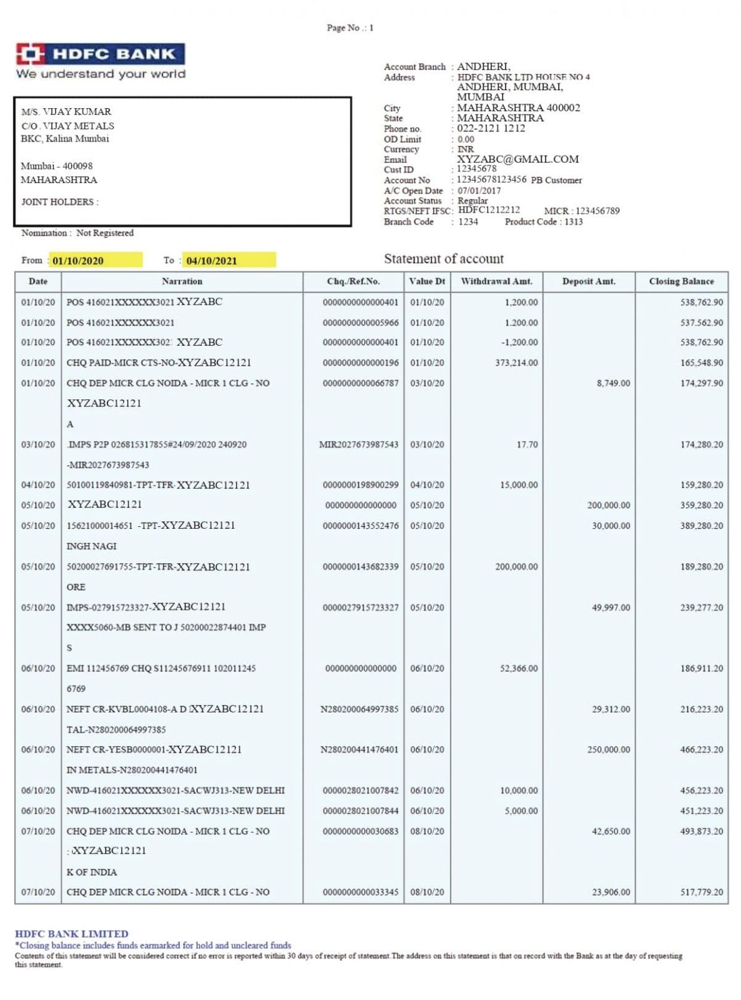
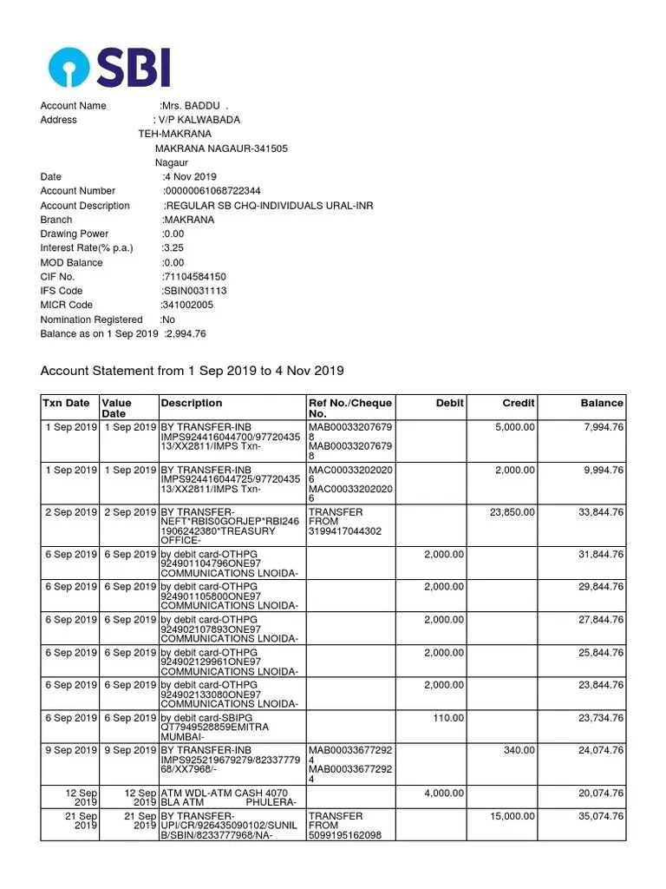
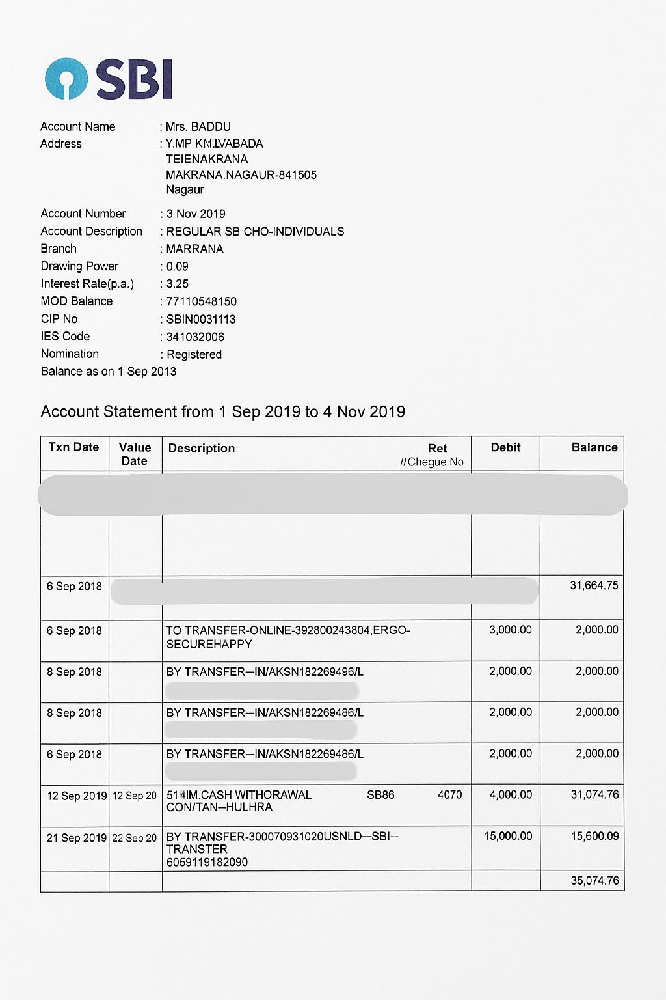

# Form Digitization Flask App

This web application allows you to upload a form image and select a template to digitize the form using OCR. The app draws bounding boxes on the form and extracts key-value pairs as JSON.

## Hosted Link

**Access the app here:**

[http://10.4.16.81:5006](http://10.4.16.81:5006)

---

## Demo Images and Template Names

Below are the demo images provided in the `templates/` folder. When uploading, select the corresponding template name shown below each image:

<p align="center">
  <br/>
  <b>Template Name: hdfc_bank</b>
</p>

<p align="center">
  <br/>
  <b>Template Name: sbi_1</b>
</p>

<p align="center">
  <br/>
  <b>Template Name: sbi_2</b>
</p>

---

## How to Use

1. **Go to:** [http://10.4.16.81:5006](http://10.4.16.81:5006)
2. Click the **Let's Start** button.
3. **Upload** one of the provided images (or your own, if you have a matching template CSV).
4. **Select the template name** that matches your image (see above).
5. Click **Digitize**.
6. The app will display:
    - The image with detected bounding boxes.
    - The extracted key-value pairs in JSON format.

---

## Folder Structure

- `templates/` — Contains the demo images (`product_lab_1.jpeg`, `product_lab_2.jpeg`, `product_lab_3.jpeg`).
- `annotations/` — Contains the template CSVs (`hdfc_bank.csv`, `sbi_1.csv`, `sbi_2.csv`).
- `output/` — Stores uploaded images, boxed images, and OCR JSON outputs.
- `pipeline.py` — The main OCR and digitization pipeline.
- `app.py` — The Flask web application.

---

## Requirements

- Python 3.7+
- Flask
- OpenCV
- pandas
- easyocr
- numpy

Install requirements with:

```bash
pip install flask opencv-python pandas easyocr numpy
```

---

## Notes

- For best results, use the provided images and select the correct template name.
- The app is currently hosted for internal/demo use at the link above.

---

For any issues, please contact the maintainer. 